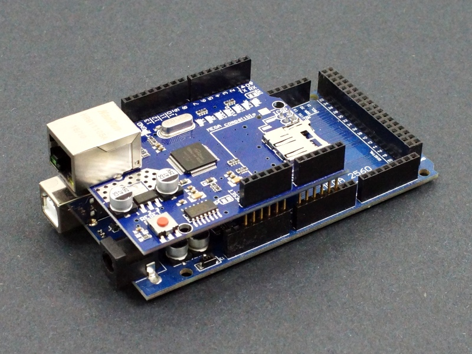
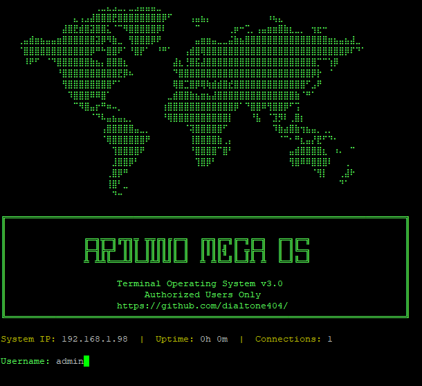
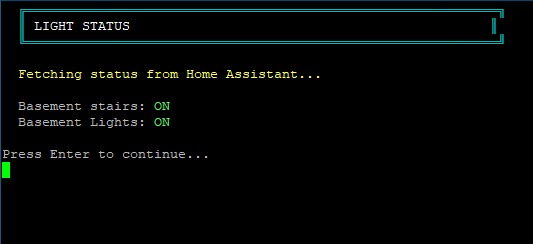
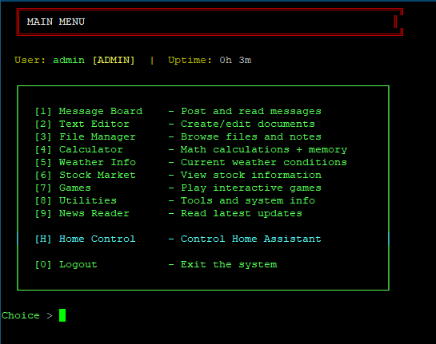
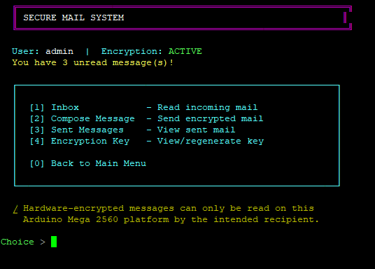
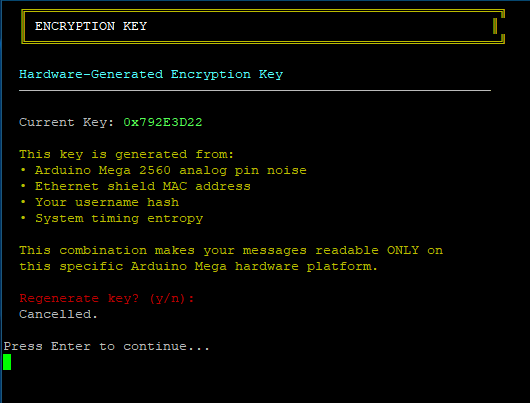

# Telnet OS / Home Assistant Controller hosted on an Arduino Mega 2560  
Arduino Mega Terminal OS is a retro-inspired BBS-style terminal operating system designed to run on an Arduino Mega with an official Arduino Ethernet Shield (with SD card). Users connect over the network using Telnet, interacting through a text-based interface similar to classic bulletin board systems.

It was a challenge getting this to compile for a system with only 256KB Flash, 8KB SRAM, 4KB EEPROM, and a 16MHz Processor!

    ⚠️ This project is experimental and a work in progress. Some features may be incomplete or buggy.



---

## Screenshots

**Login Screen**



**Home Assistant Integration**


**Control Smart Lights**



**Main Menu**



**Weather Station Temperature Data**


**Secure Message System (LAN)**



**Message Encryption**

 

# Arduino Mega 2560 OS
---
## Getting Started
1. Flash the ARDUINO_MEGA_BBS.ino sketch to your **Arduino Mega 2560**
2. Insert SD card into the Ethernet Shield
3. Connect Ethernet cable
4. Power on the Arduino
5. Check serial monitor for DHCP IP Address 
6. Open **PuTTY**

   * Connection Type: **Telnet**
   * Port: **23**
   * Hostname: (Enter the IP Address you see in Serial Monitor)
7. Log in and explore
---
## Features

* **Multi-screen terminal UI (BBS style)**
* **User authentication system**
  * Default admin account included
* **Text Editor**
  * Create, edit, save, and load files from SD card
* **Calculator**
  * Supports multiple arithmetic operations
* **Weather Information Fetcher**
* **(Beta) Stock Market Data Viewer**
* **Games**
  * Number Guessing
  * Trivia
* **Secure Message System**
* **Weather Station Sensor Support**
* **Structured SD Card File System**
* Home Assistant Controller Functionality 
---
## Hardware Requirements
* **Arduino Mega 2560**
* **Official Arduino Ethernet Shield (with SD card slot)**
* Ethernet cable
* SD card (FAT/FAT32)
---
## Network & Connection
* **Protocol:** Telnet
* **Port:** `23`
* **Client:** PuTTY (or any Telnet client)
### IP Addressing
* Uses **DHCP** by default
* **Fallback IP:**

  ```
  192.168.1.177
  ```

If DHCP fails, connect directly to the fallback IP.
---

## Default Login
| Username | Password |
| -------- | -------- |
| admin    | admin123 |
> ⚠️ Change credentials in the source code before deploying on any real network.
---

## SD Card Structure
The system relies heavily on the SD card for:
* User files
* Notes
* Logs
* Configuration data
Ensure the SD card is properly formatted to FAT32 and inserted **before boot**.
---
## Known Issues & Limitations
*  **Single User Only**
  * Only **one Telnet client** can be connected at a time
*  **Buggy Features**
  * Some modules may behave unpredictably
*  **Incomplete Features**
  * Certain planned features are partially implemented or placeholders
*   **Memory Constraints**
  * Limited by Arduino Mega RAM and flash size
*  **Not Secure**
  * Telnet is unencrypted and not safe for public networks
---
## Roadmap / Ideas
* Multi-user support
* Improved session handling
* Better error handling
* Expanded games
* Modular plugin system
* Configurable networking
* Password hashing
---
## Disclaimer
This project is for **educational and experimental purposes only**.
Do **not** expose it to the public internet.
---
## Developed By: dialtone404
Developed as a hobby/learning project inspired by classic BBS systems and terminal interfaces.

---
